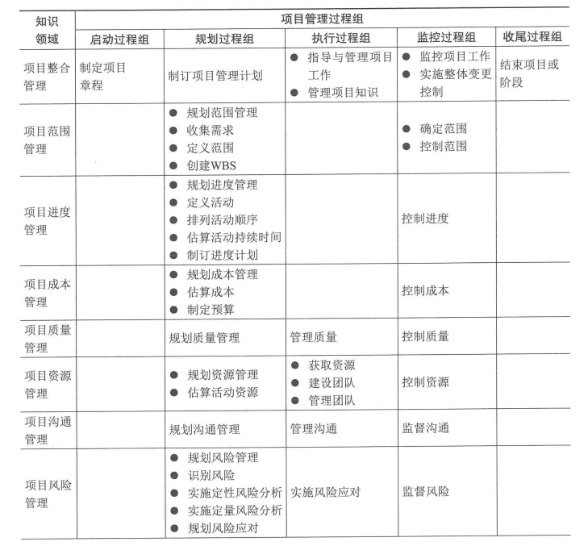
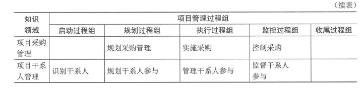

# 十五至尊图

其行包括：
项目整体管理、项目质量管理、项目范围管理、项目进度管理、项目资源管理、项目采购管理、项目风险管理、项目干系人管理、项目成本管理、项目沟通管理

其列包括启动过程组、计划过程组、执行过程组、控制过程组、收尾过程组

具体地：

| | 启动过程组 | 计划过程组 | 执行过程组 | 控制过程组 | 收尾过程组 |
|---|---|---|---|---|---|
|项目整体管理| <li>制定项目章程 | <li>制定项目管理计划 | <li>指导和管理项目执行<li>管理项目知识 | <li>监督和控制项目工作 <li>整体变更控制 | <li>结束项目或阶段 |
| 项目范围管理 | | <li>规划范围管理<li>收集需求<li>范围定义<li>创建WBS | | <li>确认范围<li>控制范围
| 项目进度管理 | | <li>规划范围管理<li>活动定义<li>排列活动顺序<li>估算活动资源<li>估算活动持续时间<li>指定进度计划 | | <li>控制进度 | | 
| 项目成本管理 | | <li>规划成本管理<li>估算成本<li>指定预算 | | <li>成本控制 | |
| 项目质量管理 | | <li>规划质量管理 | <li>管理质量 | <li>控制质量 | |
| 项目资源管理 | | <li>规划资源管理 | <li>获取资源<li>建设项目团队<li>管理项目团队 | <li>控制资源 | |
| 项目风险管理 | | <li>规划风险管理<li>识别风险<li>实施定性风险分析<li>实施定量风险分析<li>规划风险应对 | | <li>控制风险 | |
| 项目采购管理 | | <li>规划采购管理 | <li>实施采购 | <li>控制采购 | <li>结束采购 | 
| 项目沟通管理 | | <li>规划沟通管理 | <li>管理沟通 | <li>控制沟通 | |
| 项目干系人管理 | <li>识别干系人 | <li>管理干系人参与 | <li>控制干系人参与 | |

