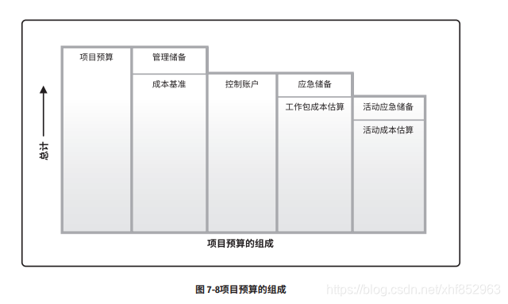

# 项目成本管理

项目活动或者组成部分的货币价值/价格，具体包括：

1. 直接工时
2. 其他直接费用
3. 间接工时
4. 其他间接费用
5. 采购价格

项目全过程耗用的各种成本的总和是项目成本。

项目成本失控的原因：

1. 对项目认识不足
2. 组织制度不健全
3. 方法问题
4. 技术的制约
5. 需求管理不当

项目成本管理过程包括（记住那张项目预算组成图）：
1. 规划成本：为规划、管理、花费、控制项目成本制定政策、程序、文档的过程
2. 估算成本：对完成项目活动所需资金进行近似估算的过程
3. 制定预算：汇总所有单个活动和工作包的估算成本，建立一个经过批准的成本基准
4. 控制成本：监督项目状态，更新项目成本，管理基准变更

## 一些术语

产品的全生命周期成本：产品整个使用期内，包括获得阶段（设计生产安装测试）、运营维护、生命周期结束时处理时发生的全部的成本。

成本的类型：
1. 可变成本：随生产量、工作量、工作时间变化的成本（比如订购n件货）
2. 固定成本：不随生产量、工作量、工作时间变化的非重复成本
3. 直接成本：直接归属于项目工作的成本（比如差旅费、工资）
4. 间接成本：来自于管理费用/几个项目共同用的项目成本分摊的成本。比如税，额外福利、保安费
5. 机会成本：在用资源生产一个商品时，失去的利用这些资源生产最佳替代品的机会——做出选择后损失的最大值。
6. 沉默成本：过去决策，且不能由现在将来任何决策所改变的成本。投资时应排除其干扰。

应急储备和管理储备（可以参考项目进度管理的内容）
* 应急储备包含在项目成本基准内，用来应对已知-未知风险，包含在成本基准中，需要项目经理知情，但是不需要顶层知情。
* 管理储备为了管理控制的目的特别留出的项目预算，应对不可预见的工作，不包括在成本基准中，但是在项目总预算和资金需求中，用于应对未知-未知风险，需要高层审批。动用时需要把管理储备加到成本基准中，导致成本基准变更。

成本基准：经过批准的、按照时间安排的成本支出计划，随时反映了经过批准的 项目成本变更。

项目预算的组成

## 规划成本（项目成本管理计划）

输入：
1. 项目管理计划
2. 项目章程
3. default * 2

工具和技术：
1. 成本分析技术
   * 技术分析

     在制定成本管理计划时，可能需要选择项目**筹资**的战略方法，比如自筹资金/股权投资/借贷等

     可能也需要说明**筹集项目资源**的方法，比如自制、采购、租用、租赁etc

     都可能对项目进度和风险产生影响。

     做这些决策可以基于的财务技术：
     1. 回收期（多少时间能回本） —— 见计算题
     2. 回报率 —— 见计算题
     3. 内部报酬率
     4. 现金流贴现
     5. 净现值
   * 专家判断
   * 会议
   * 类比估算
   * 参数估算
   * 自下而上估算 —— 先估算单个工作包，再汇总到更高层次。**准确度取决于单个工作包的规模和复杂程度**
   * 三点估算
   * 储备分析 —— 应急储备、管理储备
   * 质量成本
   * 项目管理软件
   * 卖方投标分析（比如评价外包公司的情况评估项目成本）
   * 群体决策技术

输出：
1. 项目成本管理计划
2. 项目文件更新

## 估算成本

# 编制活动成本估算需要下列三个步骤（默写）
1. 识别并分析成本的构成科目
2. 根据已识别的项目成本构成科目，估算每个科目的成本大小
3. 分析成本估算结果，找出可以相互替代的成本，协调成本之间的比例关系

输入：
1. 项目成本管理计划
2. 人力资源管理计划
3. 范围基准
4. 项目进度计划
5. 风险登记册
6. default * 2

工具和技术：
   * 技术分析

     在制定成本管理计划时，可能需要选择项目**筹资**的战略方法，比如自筹资金/股权投资/借贷等

     可能也需要说明**筹集项目资源**的方法，比如自制、采购、租用、租赁etc

     都可能对项目进度和风险产生影响。

     做这些决策可以基于的财务技术：
     1. 回收期（多少时间能回本） —— 见计算题
     2. 回报率 —— 见计算题
     3. 内部报酬率
     4. 现金流贴现
     5. 净现值
   * 专家判断
   * 会议
   * 类比估算
   * 参数估算
   * 自下而上估算 —— 先估算单个工作包，再汇总到更高层次。**准确度取决于单个工作包的规模和复杂程度**
   * 三点估算
   * 储备分析 —— 应急储备、管理储备
   * 质量成本
   * 项目管理软件
   * 卖方投标分析（比如评价外包公司的情况评估项目成本）
   * 群体决策技术

输出：
1. 活动成本估算
2. 估算依据
3. 项目文件更新

## 制定预算

#  制定预算步骤（默写）
1. 将（已经计算好的）项目总成本分摊到项目工作分解结构的各个工作包
2. 各个工作包的成本分配到包含活动中
3. 确定各项活动的成本预算支出的时间以及项目成本预算计划

输入：
1. 成本管理计划
2. 范围基准
3. 活动成本估算
4. 估算依据
5. 项目进度计划
6. 资源日历
7. 风险登记册
8. 合同
9. 组织过程资产

工具和技术：
1. 成本汇总
2. 储备分析：应急储备和管理储备
3. 专家判断
4. 历史关系
5. 资源限制平衡

输出：
1. 成本基准
2. 项目资金需求
3. 项目文件更新

## 控制成本

主要包括：
1. 对造成项目成本基准变更的因素施加影响
2. 确保所有变更请求都得到处理
3. 变更发生时，进行管理
4. 确保成本支出不超过批准的资金限额（不超出项目总限额，也不超出按时段、按WBS组件、按活动分配的限额）
5. 监督成本绩效：找出和分析当前成本和成本基准的偏差
6. 对照资金支出，监督工作绩效
7. 防止在成本/资源使用报告中出现未批准的变更
8. 向干系人报告所有批准的变更和相关设备

输入：
1. 项目管理计划
2. 项目资金需求
3. 工作绩效数据
4. 组织过程资产

工具和技术：
1. 挣值管理
2. 预测
3. 完工尚需绩效指数
4. 绩效审查：成本绩效随时间的变化，
5. 项目管理软件
6. 储备分析
7. 成本汇总：先把成本估算汇总到WBS工作包，再由工作包汇总到更高的层次
8. 历史关系：历史数据建模
9. 资金限制平衡：在既定的资金限制下，确保项目各阶段、各部位和整个项目都有足够的资金，可能会导致进度计划的改变。

输出：
1. 工作绩效信息
2. 成本预测
3. 变更请求
4. 项目管理计划更新
5. 项目文件更新
6. 组织过程资产更新

