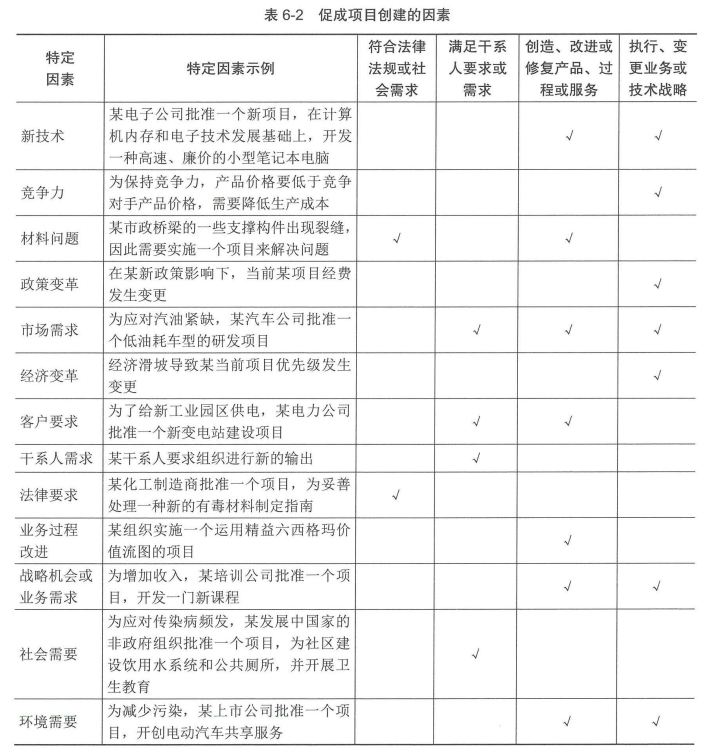

PMBOK：项目管理知识体系

项目：
1. 独特的产品、服务、成果
2. 临时性工作
3. 项目驱动组织进行变更 —— 实现将来状态、达到特定目标
4. 项目创造业务的价值
5. 项目启动的背景 —— 若干
   
   

## 项目、项目集、项目组合

* 项目集
  
  达成组织的一系列目的和目标，可能需要实施多个项目。

  一组相互关联并且被协调管理的项目、子项目和项目集活动

* 项目组合
  
  为了实现战略目标而组合在一起管理的项目、项目集、子项目组合和运营工作。