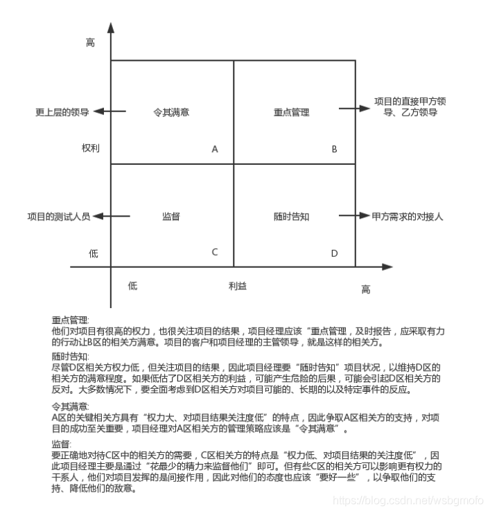

# 沟通管理

IT 项目沟通管理的重要性: 

和IT项目成功相关的四个因素: 
1. 主管层的支持
2. 用户参与
3. 有经验的项目经理
4. 清晰的业务目标

都依赖良好的沟通能力. 

项目沟通管理的相关理论

沟通模型的关键要素
1. 编码
2. 信息和反馈 -- 编码结果
3. 媒介
4. 噪声
5. 解码

五个基本状态
1. 已发送
2. 已收到
3. 已理解
4. 已认可
5. 已转化为积极的行动

沟通渠道
1. 正式沟通渠道: 组织内依据一定原则的信息传递和交流. 效果好, 严肃, 约束力强, 权威, 保密. 但是刻板, 慢. 
2. 非正式沟通渠道: 形式多样, 速度快, 信息不确切; 容易失真, 导致小团体

过程: 
1. 规划沟通管理: 根据干系人的信息需要和组织可用资产情况, 制定合适的项目沟通方式和计划
2. 管理沟通: 根据沟通管理计划, 生成\收集\分发\储存\检索\处置 项目信息
3. 控制沟通: 在整个项目生命周期中对沟通进行监督控制, 确保对项目干系人的及时有效信息披露

## 规划沟通管理

输入
1. 项目管理计划
2. 干系人登记册
3. default * 2

工具和技术
1. 沟通需求分析 —— 通过沟通需求分析，确定干系人的信息需求，包括需要信息类型和样式，以及信息对干系人的价值。沟通渠道路径计算: n(n-1)/2。
2. 沟通技术 —— 可以使用各种技术。主要考虑信息传递的紧迫性、频率和形式，技术的可用性、易用性，项目环境，保密需求
3. 沟通模型
4. 沟通方法 —— 交互式沟通、推式沟通、拉式沟通
5. 会议

输出
1. 沟通管理计划
2. 项目文件更新

## 管理沟通

根据沟通管理计划，生成\收集\分发\储存\检索\处置 项目信息。目的是促进项目干系人之间实现有效率和有效果的沟通。

输入：
1. 沟通管理计划
2. 工作绩效报告
3. default * 2

工具和技术
1. 沟通技术
2. 沟通模型
3. 沟通方法
4. 信息管理系统
5. 报告绩效 —— 收集和发布绩效信息，包括状况报告、进展测量结果和预期结果（对过去绩效的分析、项目预测分析、问题和风险的当前状态、本报告期完成的工作、下个报告期完成的工作、批准的变更汇总、需要审查讨论的其它信息）

输出
1. 项目沟通
2. 项目管理计划更新
3. 项目文件更新
4. 组织过程资产更新

## 控制沟通

在整个项目生命周期中对沟通进行监督控制, 确保对项目干系人的及时有效信息披露。保持所有沟通参与者之间的信息流动最优化

输入
1. 项目管理计划
2. 项目沟通
3. 问题日志
4. 工作进行数据
5. 组织过程资产

工具和技术
1. 信息管理系统
2. 专家判断
3. 会议

输出
1. 工作绩效信息
2. 变更请求
3. 项目管理计划更新
4. 项目文件更新
5. 组织过程资产更新

# 项目干系人管理

过程：
1. 识别干系人
2. 规划干系人管理
3. 控制干系人参与

## 识别干系人

找出影响项目决策、活动、结果的个人、群体、组织，以及被项目影响的个人、群体和组织，分析和记录相关信息的过程。

相关信息：利益、参与度、互相依赖、影响力、对项目成功的潜在影响。

输入
1. 项目章程
2. 采购文件
3. default * 2

工具和技术
1. 干系人分析：系统地分析定性和定量信息，确定项目中要考虑哪些人的利益。
   
   步骤：
   * 识别干系人和相关的信息
   * 分析干系人可能的影响并分类排序
   * 评估干系人对不同的情况可能做出的反映，用于制定策略和施加正面影响

   干系人分类模型：
   1. 权利/利益方格 —— 职权和项目结果利益进行分类
   2. 权利/影响方格 —— 职权和主动参与项目的程度进行分类
   3. 影响/作用方格 —— 主动影响项目和改变项目计划/执行的能力
   4. 凸显模型 —— 根据干系人的权力、紧迫程度、合法性对干系人进行分类
2. 专家判断
3. 会议

输出
1. 干系人登记册

## 规划干系人管理

基于干系人的需求，利益和对项目成功的潜在影响的分析，制定合适的管理策略，有效调动干系人参与整个项目生命周期的过程

输入
1. 项目管理计划
2. 干系人登记册
3. default * 2

工具和技术
1. 分析技术
2. 专家判断
3. 会议

输出
1. 干系人管理计划
2. 项目文件更新

## 控制干系人参与

全面监督 项目干系人 之间的关系，调整策略和计划，调动干系人参与。

作用：随着项目进行维持和提升干系人参与活动的效率和效果。

权利/利益方格：根据干系人的职权大小和获利进行分类

输入
1. 项目管理计划
2. 问题日志
3. 工作绩效数据
4. 项目文件

工具和技术
1. 信息管理系统
2. 专家判断
3. 会议

输出
1. 工作绩效信息
2. 变更请求
3. 项目管理计划更新
4. 项目文件更新
5. 组织过程资产更新

## MISC

### 项目干系人管理的重要性

1. 更多干系人的支持 —— 搞到更多的资源
2. 快速频繁有效沟通可以确保干系人需求、期望的理解，是项目干系人管理人的一部分
3. 预测项目干系人对项目的影响，尽早制定行动计划，避免干扰。

### 项目干系人管理的主要内容

项目干系人分析

沟通管理

问题管理

项目干系人管理依据：

1. 项目管理计划
2. 沟通管理计划
3. 组织过程资产
4. 分析技术
5. 沟通方法
6. 人际关系技能
7. 管理技能
8. 信息管理系统

干系人的参与程度可以按照下列方式分类:
1. 不知晓
2. 抵制
3. 中立
4. 支持
5. 领导

可以在干系人登记册、干系人参与评估矩阵里记录干系人的当前参与程度

