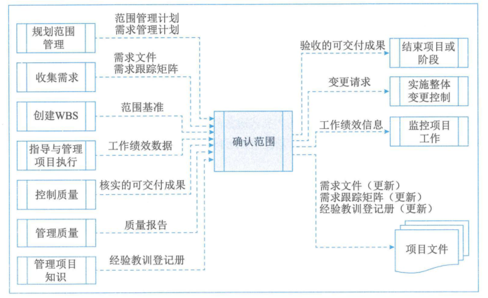

# 项目范围管理

项目范围(scope)是为了达到项目目标，交付特定产品或者服务，需要做到的东西。

项目范围管理：就是确定哪些东西项目该做，哪些东西项目不该（不需要）做。

范围不明确将导致团队成员的浪费时间和目标偏离。因此，范围管理需要清晰定义项目目标。这个定义需要和干系人达成一致，然后根据范围定义划分为工作包。

## 项目范围管理概述

做且只做范围内的事。主要包括：

1. 明确项目边界 —— 哪些东西是否在项目范围内
2. 对项目执行工作进行监控 —— 该做的做了，不该做的说不
3. 防止项目范围发生蔓延 —— 蔓延：未经控制的产品或者项目范围扩大（未对时间、成本和资源做相应调整）

## 产品范围和项目范围

是项目中存在的两个相互关联的范围。

* 产品范围：产品/服务中需要包含的功能。
* 项目范围：为了交付产品，项目需要做的工作。—— 项目管理计划的基础。

基于产品范围（实际上是需求的范围）确定项目范围。因此，产品范围是项目范围的基础。

**项目的范围基准（重要）：**
* 经过批准的项目范围说明书，WBS，WBS词典

## 范围管理过程概述

| | 启动过程组 | 规划过程组 | 执行过程组 | 控制过程组 | 收尾过程组 |
|:---|:---|:---|:---|:---|:---|
| 项目范围管理 | | 
规划范围管理
收集需求
定义范围
创建WBS | | 
确认范围
控制范围 | |
| | | | | | | 

## 规划范围管理

编制范围管理计划和需求管理计划，书面描述如何定义、确认、控制项目范围的过程

输入：
1. 项目章程
2. 项目管理计划
3. default*2

工具和技术：
1. default*2

输出：
1. 范围管理计划
   
   是制定**项目管理计划**及其他过程的主要输入，包括：
   * 如何制定项目范围说明书
   * 如何根据项目管理说明书创建WBS
   * 如何维护和批准WBS
   * 如何确认和验收已完成项目的可交付成果
  
   项目范围管理计划可能是项目管理计划中的部分，也可以是单独的一份内容。可详可略，可正式/非正式。
2. 需求管理计划
   
   是对项目需求进行定义、确定、记载、核实管理和控制的**行动指南**，主要有：
   * 如何规划、跟踪、汇报各种需求活动
   * 需求管理需要的资源
   * 培训计划
   * 项目干系人如何参与需求管理
   * 怎么判断项目范围和需求不一致（准则和纠正流程）
   * 需求跟踪结构，哪些需求属性需要纳入跟踪矩阵，在哪些项目文件中追踪需求
   * 配置管理活动

## 收集需求

需求是有分类的：
1. 业务需求：是整个组织的高层次需要，比如：解决业务问题、抓机会、实施项目的原因
2. 干系人需求：比如甲方爹爹的需要
3. 过渡需求：从当前状态过渡到将来状态需要的临时努力，比如培训、数据转换适配
4. 质量需求：用于度量 项目可交付成果完成 或者 项目需求实现 的任何条件或者标准。
   
   QFD对质量进行细分：
   * 基本需求
   * 期望需求
   * 意外需求   

输入：
1. 项目章程
2. 范围管理计划
3. 需求管理计划
4. 干系人管理计划
5. 干系人登记册

工具和技术：
1. 访谈 —— 1v1
2. 焦点小组 —— 干系人和专家集中，群体访谈 & 互动式讨论
3. 引导式研讨会 —— 对产品需求集中讨论，快速定位职能需求和协调干系人差异。
4. 群体创新技术
   * 头脑风暴
   * 名义小组技术（投票排列有用的创意，做进一步头脑风暴）
   * delphi
   * 思维导图（反应创意间的共性、差异、联系）
   * 亲和图（想法、经验知识等信息 的 图解汇总）
   * 多标准决策分析（借助决策矩阵，用系统分析方法建立如风险水平、不确定性、价值收益等标准，对众多方案评估排序）
5. 群体决策 —— 为达成期望结果对多个方案进行评估。用途：开发产品需求、对产品需求进行归类排序
   * 一致同意
   * 大多数原则
   * 相对多数原则
   * 独裁
6. 问卷
7. 观察
8. 原型法 —— 根据初步需求，高出模型，基于模型和干系人讨论需求。
9.  标杆对照 —— benchmark借鉴
10. 系统交互图 —— 产品范围的可视化描述，主要描述系统和参与者怎么交互。
11. 文件分析 —— 商业计划、营销文档、协议、招投标文件、建议邀请书、业务流程、逻辑数据模型、业务规则库、软件文档、用例、其它需求、问题日志、政策法规等。

输出：
1. 需求文件 —— 各种单一的需求将如何满足和项目相关的业务要求。包括：
   * 业务需求
   * 干系人需求
   * 解决方案需求
   * 项目需求
   * 过渡需求
   * 需求的假设条件、依赖关系和制约因素
2. 需求跟踪矩阵
   
   需求管理：在开发过程中维持需求一致性和精确性的所有活动集合。

   比如需求基线控制、项目计划和需求一致，单个需求和文档的版本控制，需求和联系链，需求和项目其它交付物的联系。

   项目需求需要可跟踪性：将单个需求和其它**元素**的依赖关系和逻辑建立跟踪。

   元素：需求、业务规则、系统组件、帮助文档etc。
   
   每个配置项的需求 到 产品需求 都需要是**双向可跟踪**的。
   
   正向跟踪、反向跟踪：原始需求 —— 需求文件 —— 下游工作产品 （共五种类型）

   需求矩阵是整个项目声明周期中跟踪需求的一种方法。

   
   

## 定义范围

指定项目和产品的详细描述，明确产品、服务、成果的边界。哪些需求在项目范围内，哪些不在？

识别出来的需求未必包含在项目中，所以需要依据项目需要进行裁剪。

输入：
1. 范围管理计划
2. 项目章程
3. 需求文件
4. 组织过程资产

根据和技术
1. 专家判断
2. 产品分析
3. 备选方案生成
4. 引导式研讨会

输出：
1. 项目范围说明书
   
   对项目&产品范围、主要可交付成果、假设条件、制约因素的描述。

   内容：
   * 产品范围描述
   * 项目范围描述
   * 验收标准
   * 可交付成果
   * 除外责任 —— 哪些东西不是项目范围
   * 制约因素
   * 假设条件

   作用：
   * 确定范围
   * 沟通的基础（比如，管理干系人的期望）
   * 规划和控制依据
   * 变更基础
   * 规划基础

2. 项目文件更新

## 创建WBS（工作分解结构）

把项目可交付成果和项目工作分解成 较小的、易于管理的组件的过程。

WBS完成后，需要干系人对WBS进行确认并且达成共识。

输入：
1. 范围管理计划
2. 项目范围说明书
3. 需求文件
4. default*2

工具和技术
1. 分解
2. 专家判断

输出：
1. 范围基准（经批准的项目范围说明书、WBS、WBS词典）
2. 项目文件更新

### WBS的层次
* 里程碑：某个可交付成果或者阶段的完成。重要的检查点是里程碑，重要的里程碑是基线。
* 工作包：WBS的叶子节点，最底层的可交付成果或者项目工作组成部分。大小遵循8-80原则。
* 控制账户：一种管理控制点（WBS的子树节点）。项目经理在控制账户上考察项目执行情况。
* 规划包：控制账户之下，工作包之上。暂时用来做计划，最终会被分解。
* WBS词典：WBS的每个部分都有标识符，是成本、进度和资源信息的汇总结构。汇总的WBS各部分构成的文件是WBS词典。

### 项目工作和成果分解成WBS（工具和技术）

方法：
* 专家判断
* 分解

步骤：
1. 识别和分析可交付成果和相关工作
2. 确定WBS的结构和编排方法
3. 自上而下逐层细化分解
4. 为每个WBS项赋予编码
5. 确定WBS的合理性

分解原则：
1. 功能或技术原则。在创建WBS时，需要将不同人的工作分开。
2. 组织结构
3. 系统或者子系统

WBS分解有下列三种方式：
1. 项目生命周期作为分解的第二层（研发，测试，验收etc），交付成果作为第三层
2. 主要可交付成果作为分解的第二层（比如模块），
3. 整合可能由外部实施的组件，作为外包的一部分，卖方编制合同WBS。

WBS是全体团队成员、用户和项目干系人共同完成、一致确认的东西。

WBS包括树形和表形。

**在分解时需要注意下列八个方面：**

1. WBS需要面向可交付成果
2. WBS需要符合项目的范围
3. WBS底层应该支持计划和控制：支持项目管理计划，也要允许管理层监控项目进度和预算
4. WBS元素可以由多个人参与，但是有且仅有一个人负责
5. WBS的指导。一般控制在4 - 6层，大项目可以超
6. WBS应该包括项目管理工作，也包括分包出去的工作
7. WBS的编制需要所有项目干系人、所有项目成员的参与
8. WBS可能会变

WBS的目的和用途：
1. 明确项目范围，团队成员理解任务性质和努力方向
2. 清楚定义项目边界
3. 为各个独立单位分派人员，规定职责
4. 对独立单元进行时间、资源估算
5. 为计划、预算、进度奠定基础，确定项目进度和控制的基准
6. 项目工作和财务账目相联系
7. 确定工作内容和工作顺序 —— 通过分解任务，按照任务逻辑实施项目
8. 防止需求蔓延

## 范围确认

正式地 验收 已完成的可交付成果。

确认范围应该贯穿项目始终

步骤：
1. 确认范围确认时间
2. 需要哪些投入
3. 范围接受的标准
4. 会议组织步骤
5. 组织范围确认会议

作用：
1. 验收过程客观性
2. 定期确认每个可交付成果，提升最终成果验收通过的可能性

输入：
1. 项目管理计划 —— 范围管理计划、需求管理计划、范围基准
2. 项目文件 —— 需求文件、需求跟踪矩阵、质量报告、经验教训登记册
3. 工作绩效数据 —— 符合需求的程度、不一致的数量/严重性、
4. 核实的可交付成果 —— 完成的、被质量控制过程检查为正确的 可交付成果

工具技术：
1. 检查 
2. 群体决策

输出：
1. 验收的可交付成果
2. 变更请求
3. 工作绩效信息
4. 项目文件更新

### 项目干系人做范围确认时需要检查一些问题

1. 可交付成果是不是确定的
2. 是不是里程碑明确
3. 明确的质量标准
4. 审核和承诺的清晰表达
5. 项目范围是不是覆盖了所有活动
6. 项目范围的风险是不是太高

### 干系人关注点

1. 管理层关注项目范围（摊子）
2. 客户关心产品范围
3. 管理人员关系制约因素（可交付成果、时间、钱、资源、风险）
4. 成员关心自己的元素

## 控制范围

监督项目和产品的范围状态，管理范围基准变更。

作用：在项目期间保持对范围基准的维护。

输入：
1. 项目管理计划 —— 若干条东西
2. 项目文件 —— 若干条东西
3. 工作绩效数据 —— 收到的、接受的变更请求数量、确认的、完成的可交付成果数量
4. 组织过程资产 —— 比如模板

工具和技术：
1. 偏差分析
2. 趋势分析

输出：
1. 工作绩效信息
2. 变更请求
3. 项目管理计划更新
4. 项目文件更新