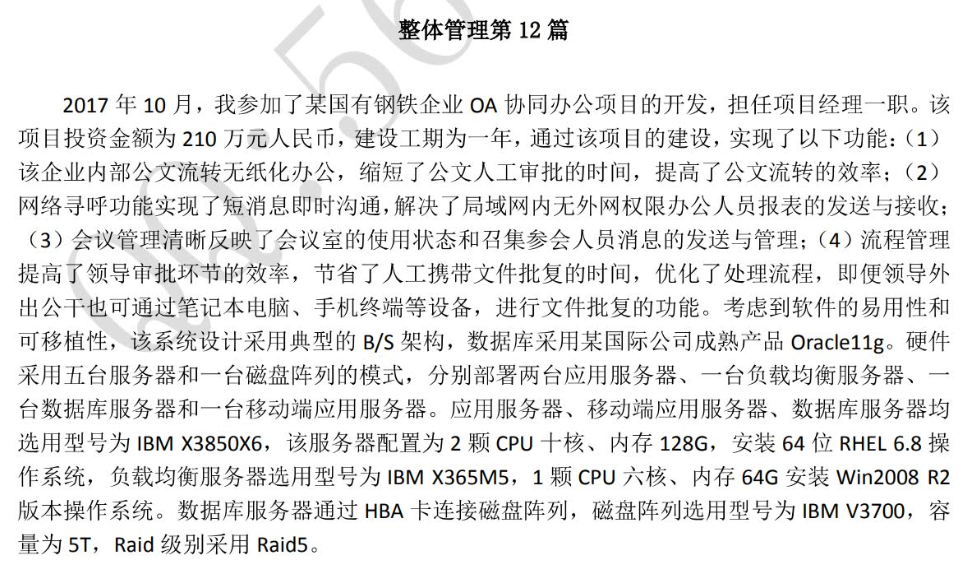
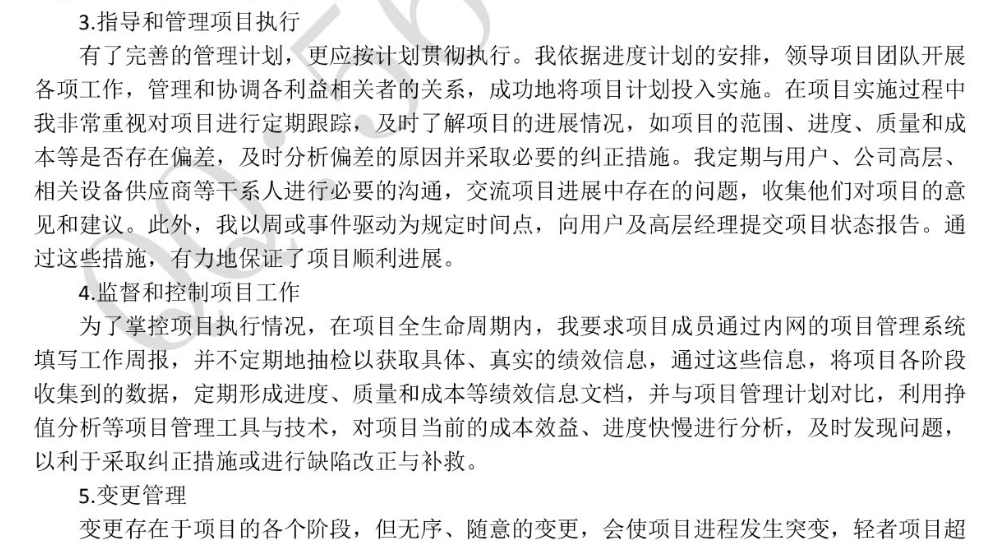
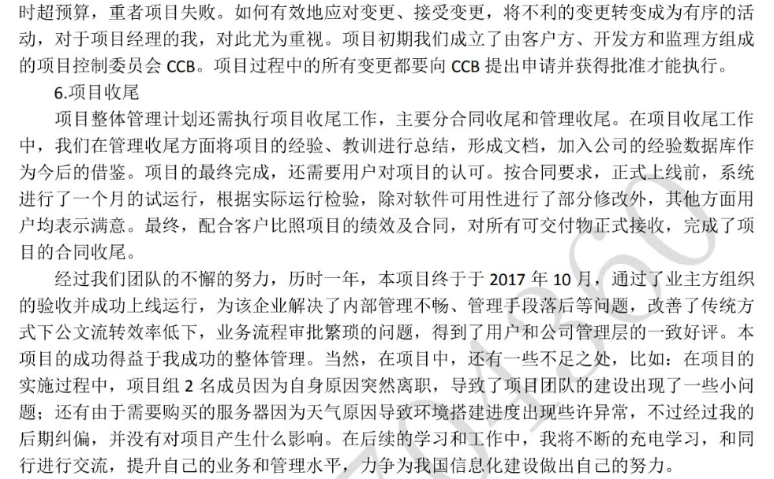

挑一些相对靠谱的：

由于系统具有建设规模大（涵盖物价部门几乎所有业务）建设时间紧（一年）、涉及干系人多（内部干系人包括各项目组成员、公司领导和相关职能部门人员、外部干系人不仅包括市局各科室，也包括各区县相关部门人员、运营商等）、参与的项目成员多（高峰时达到60人，主要分为硬件集成部署组、数据中心组、软件开发组、平台测试组）、采购货物众多（网络和安全设备、存储设备、服务器、负载均衡、统一认证、虚拟化平台、数据库、触摸屏、信息采集设备等）等特点，为了保证项目按时完成，我依据强矩阵项目组织结构构建项目团队，通过有效的项目管理，特别是高效的整体管理，带领项目团队全体顺利完成项目。本文将围绕项目的质量管理进行重点讨论。

项目运行的各项活动都需要人来完成，对项目团队的顶层规划和约束更是项目顺利完成的关键。因此，在本项目执行过程中的整体管理具有非常重要的地位。在本项目中，我作为项目经理，除了对其余管理流程进行管理外，特别地对项目整体管办理流程进行重点关注，主要包含 制定项目章程、制定项目管理计划、指导和管理项目执行、监督和控制项目工作、管理项目、知识、整体变更管理以及项目收尾工作。本项目的目的是搭建和集成隐私计算平台并且通过甲方验收，是公司在本行业的新尝试，因此公司领导对此项目非常重视。

1. 制定项目章程

项目章程是正式批准一个项目的文档。项目合同签订之后，各相关方参与了项目启动会议，项目发起人正式发布了项目章程。项目组内随后召开会议，根据项目章程、项目合同、项目表述等分析了项目干系人和项目的初步范围，最后形成了项目初步范围说明书。
（这块感觉不太行）

2. 制定项目管理计划

项目管理计划是项目管理的基础。计划的制定贯穿于整个项目过程，项目实施中的各种因素的变化都可能导致项目计划的修正。我组织专家对项目各个过程的工作量、成本、工期、资源等进行了估算，在估算数据的基础上编制了科学、合理的项目管理计划。在项目管理计划中，我们对项目目标、范围、组织、项目监控措施进行了明确，并且定义了各个里程碑的完成时间点和主要交付物。随后，我们提交计划评审申请到公司PMO，由PMO组织所有项目干系人共同评审计划，获得通过后，将批准后的项目管理计划纳入计划基线的管理。

3. 指导和管理项目执行

我依据项目进度计划的安排，领导项目团队展开各项工作。

------

