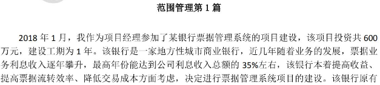
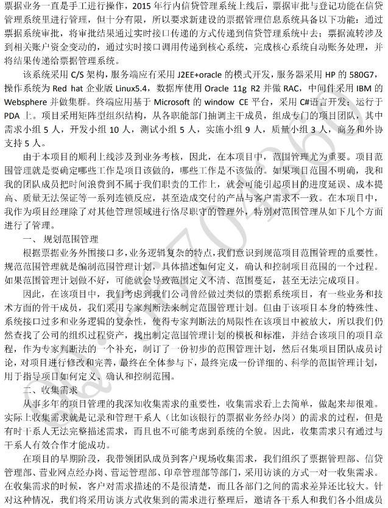
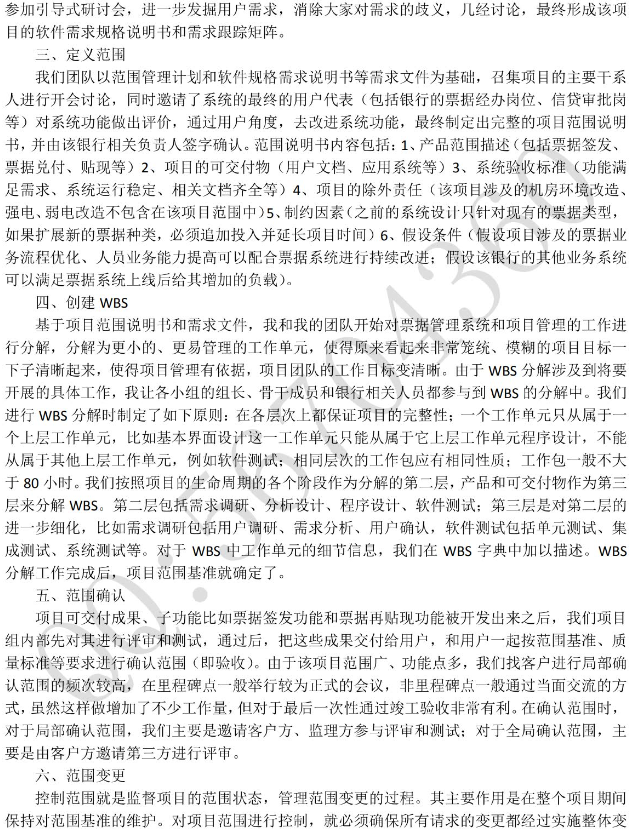
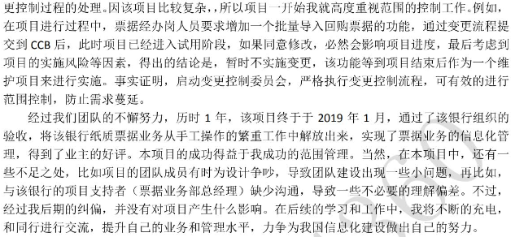
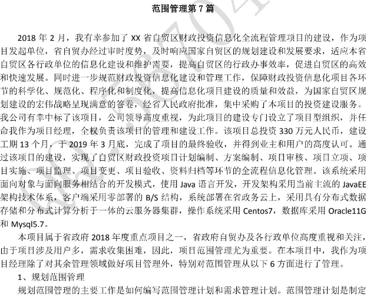
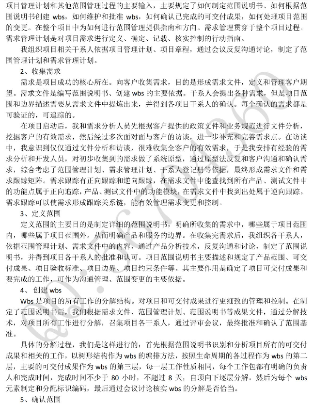

挑一些靠谱的：

项目采用强矩阵型组织结构，从各个职能部门中抽调主干成员组成项目团队，包括产品1人，开发16人，测试4人，质量3人，商务和外协支持5人。

项目范围管理就是要确定哪些工作是项目该做的，哪些工作不是项目该做的。如果项目范围不明确或者没有经过及时评审通过，项目团队成员就可能向不属于我们职责的工作中投入人力，造成范围蔓延，进而引起项目的进度延误、成本提高、质量无法保证等一系列问题，甚至可能导致交付产品和客户需求的不一致。在本项目中，我作为项目经理除了对其它管理事项进行协调运作外，特别地对范围管理从如下方面进行了处理：

1. 规划范围管理

隐私计算平台外围接口多，业务逻辑复杂。要管理好众多接口、功能、算法需要从顶层就对范围进行管理。在项目运行之初，我们就意识到建立项目范围管理规范和流程的重要性。规范项目管理就是编制范围管理计划、具体描述如何定义/确认/控制项目的一个过程。如果范围管理计划做不好，就可能会导致范围定义不清、范围蔓延，甚至导致项目无法完成。

因此，在项目运行中公告，我们考虑到公司曾经做过类似的隐私计算平台项目，有一些业务和技术方面的骨干成员，采用专家判断法来制定项目范围管理计划。但是，由于项目本身的特殊性、系统接口多样性和业务的复杂性，使得专家判断法的局限性在项目中被放大。所以，我们仍然查找了公司的组织过程资产，找出制定范围管理计划的模板和标准，并且结合项目章程作为补充，制定了一份初步的范围管理计划，然后召集项目团队成员进行讨论和完善，群策群力输出一份较为科学的范围管理计划，指导项目如何定义、确认、控制范围，得到干系人的批准。

2. 收集需求

收集客户需求是厘清项目范围的重要步骤，实际上就是记录和管理干系人（比如保险公司对隐私计算平台）的需求的过程。但是，众多的干系人往往从自身便利性的角度出发，没法考虑项目/系统的全貌，或者无法描述清楚需求，这都给确认需求带来了较大的麻烦。为此，我们分别和保险的业务部门、数据中心、软件研发中心等进行对接，采用访谈和座谈会的方式进行需求的粗粒度收集和分类并整理成清单，再针对需求清单中的问题分别访谈、消除歧义。最终形成项目的软件需求规格说明书和需求跟踪矩阵。

3. 定义范围

项目团队以范围管理计划和软件规格需求说明书等文件为基础，召集项目的主要干系人进行开会讨论，同时邀请了系统的最终用户代表（包括保险公司的票据岗位、信贷审批岗位等）对系统功能做出评价，通过用户角度改进系统功能，最终制定完整的项目范围说明书，并且由相关负责人签字确认。范围说明书包括：1. 产品范围描述，2. 项目的可交付物（软件系统、用户文档、培训材料等），3. 系统验收标准（功能满足需求、运行稳定、文档齐全等），4. 项目的除外责任（机房改造、强电弱电改造的相关工作不在项目范围之中）5. 制约因素（当前系统只适用于现存的隐私计算业务，比如隐私求交、联邦学习接口等），6. 假设条件（假设系统上线后可以满足负载）等。

4. 创建WBS

基于项目范围说明书和需求文件，我带领项目团队将需求进行分解成更小的工作单元。由于WBS的分解工作涉及到即将开展的具体工作，我安排项目团队各组组长和联络人参与到WBS分解工作中。我们进行WBS分解时，首先依照树形拓扑进行逐个细化，第一层节点定义为功能模块；第二层节点依照项目生命周期进行拆分，第三层是对第二层的进一步细化，比如功能开发、单元测试、集成测试、系统测试等。对于WBS工作单元的细节信息，我们在WBS词典中进行阐述。上述WBS、WBS词典和经过批准的项目范围说明书共同构成了项目的范围基准，纳入项目文件管理变更。

1. 确认范围

在每个i城北项目的可交付成果、子功能（比如票据签发功能）开发完毕之后，先由开发组、测试组进行内部评审、测试和质量控制。内部测评通过后，组织客户定期进行范围确认，主要依据核实的可交付成果、需求文件、需求跟踪矩阵等文件，通过现场检查等方法进行范围确认，形成验收的可交付成果。在范围确认过程中，客户对交付成果可能存在不满意，于是需要按照客户更细致的要求对范围进行变更，按照项目整体变更控制流程进行控制。

1. 控制范围

控制范围主要是对范围进行变更管理，防止项目工作超过范围，防止需求蔓延。范围控制的主要工作包括：考虑项目范围说明书、工作绩效数据、需求文件、需求跟踪矩阵等，通过偏差分析识别可能影响范围变更的因素，并且尽量使这些因素向有利方向发展；判断范围变更是否已经发生；管理实际发生的变更，按照整体变更控制的流程进行处理。形成变更请求和工作绩效信息，更新项目管理计划、项目文件和组织过程资产。

------

