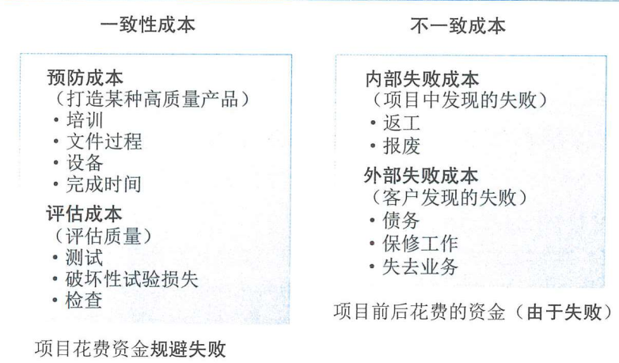

# 项目质量管理

质量：反映实体满足主体明确和隐含需求的能力的特性的综合

质量和等级的区别：
1. 质量：实现的性能和成果
2. 等级：设计的意图

主要包括下列过程：
1. 规划质量管理
2. 管理质量/实施质量保证
3. 控制质量

### PDCA模型

1. plan —— 方针和目标的确定、方案和计划的布局
2. do —— 执行，根据已知的信息，设计方案、具体运作
3. check —— 检查，总结执行结果，明确效果，找出问题
4. act —— 处理，对总结检查的结果进行处理，成功经验加以标准化，失败教训总结，没有解决的问题在下一个pdca循环中解决。

按照这样的顺序进行质量管理，循环不止

### 全面质量管理（TQM）

全员、全过程、全企业的品质管理，有四个特征：

1. 全员参与
2. 全过程
3. 全面方法
4. 全面结果

## 规划质量管理

输入
1. 项目章程 —— 对产品和项目的高层次描述，审批要求、项目目标、成功标准
2. 项目管理计划 —— 需求管理计划、风险管理计划、干系人参与计划、范围基准
3. 项目文件 —— 假设日志、需求文件、需求跟踪矩阵、风险登记册、干系人登记册
4. default * 2

工具与技术
1. 专家判断
2. 数据收集 —— 标杆对照、头脑风暴、访谈etc
3. 数据分析 —— 成本效益分析（估算备选方案优劣势，选择最佳效益的方案，达到质量要求的效益包括干系人满意、减少返工、提高生产率、降低成本）、质量成本（在产品生命周期中发生的所有成本，包括预防成本、评估成本、失败成本。比如预防质量低劣的成本，评估特定产品成果服务的成本，产品和需求不一致的成本）
   
   
4. 决策技术 —— 多标准决策分析工具，用于识别关键事项和核实的备选方案，排定质量测量指标的优先顺序
5. 数据表项 —— 流程图、逻辑数据模型、矩阵图、思维导图、
6. 测试和检查的规划 —— 如何测试或者检查产品、成果、服务。比如alpha-test，beta-test。
7. 会议

输出
1. 质量管理计划 —— 项目采用的质量标准、质量目标、角色和职责、需要审查的成果和过程、质量控制管理活动、质量工具、和项目相关的主要流程
2. 质量测量指标 —— 按时完成任务的百分比、CPI的成本绩效/故障率、测试覆盖度etc
3. 项目管理计划更新 —— 风险管理计划、范围基准
4. 项目文件更新 —— 经验教训登记册、需求跟踪矩阵、风险登记册、干系人登记册

## 管理质量

把组织的质量政策用于项目，把质量管理计划转化成为可行的质量活动。

目的:
1. 提高实现质量目标的可能性
2. 识别无效过程和质量低劣的原因
3. 用控制质量过程的数据向干系人展示项目的总体质量状态

输入
1. 项目管理计划
2. 项目文件 —— 经验教训登记册、质量测量指标、质量控制测量结果、风险报告
3. 组织过程资产

工具和技术
1. 数据收集 —— 比如核对单
2. 数据分析 —— 备选方案分析、文件分析、过程分析、根因分析
3. 决策技术 —— 项目决策、产品决策？
4. 数据表现 —— 亲和图、因果图（石川图）、流程图、直方图、矩阵图、散点图
5. 审计 —— 确认项目活动是否遵循了组织和项目的政策、流程的结构化、独立的过程。目标：识别&分享好的实践、识别&协助改进不好的实践，留痕存档
6. 面向X的设计 —— 面向什么东西（而可靠性、装配、成本、可用性、服务等）的设计
7. 问题解决  —— 定义问题，识别根本原因，生成可能的方案，选择最好的方案，执行，评估有效性
8. 质量改进方法 —— PDCA & 6-$\sigma$原则

输出
1. 质量报告 —— 质量管理问题、纠正措施建议etc
2. 测试和评估文件
3. 变更请求 
4. 项目管理计划更新 —— 质量管理计划、范围/进度/成本基准
5. 项目文件更新 —— 问题日志、经验教训册、风险登记册、
6. 组织过程资产更新

## 控制质量

为了评估绩效，确保质量达标，从而记录&监督质量管理活动的过程

作用：
1. 核实项目可交付成果和工作达到主要干系人的质量要求，可用于最终验收
2. 确定项目输出是否达到预期目标（所有的标准要求法律规范）

输入
1. 项目管理计划
2. 项目文件 —— 测试和评估文件、质量测量指标、经验教训登记册
3. 可交付成果
4. 工作绩效数据 —— 比如产品状态数据（观察结果、质量测量指标、性能），进度绩效和成本绩效的项目质量信息
5. 批准的变更请求 —— 比如缺陷补救、修订工作方法/进度计划etc
6. default * 2

工具和技术
1. 数据收集 —— 核对单/核查表/抽样/问卷调查
2. 数据分析 —— 绩效审查/根因分析
3. 检查
4. 测试/产品评估
5. 数据表现 —— 因果图、控制图、直方图、散点图
6. 会议

输出
1. 工作绩效信息 —— 包括需求实现情况、拒绝原因、返工要求、纠正建议、核实的可交付成果列表、质量测量指标的状态、过程调整需求etc
2. 质量控制测量结果
3. 核实的可交付成果
4. 变更请求
5. 项目管理计划更新
6. 项目文件更新 —— 问题日志（多次不符合质量要求的成果可以记成问题）、经验教训登记册、风险登记册、测试评估文件

