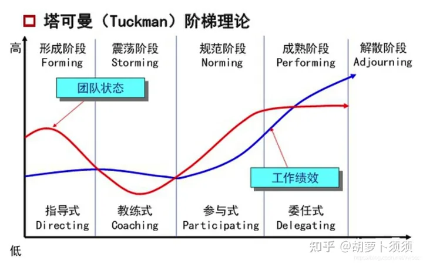

# 项目资源管理

### 项目经理权力

项目经理具有领导者和管理者的双重身份

项目经理的权力：

来自组织
1. 职位权力
2. 惩罚权力
3. 奖励权力

来自个人
4. 专家权力
5. 参照权力

领导者工作：
1. 确定方向
2. 统一思想
3. 激励和鼓舞

冲突和竞争

冲突：两个或以上的社会单元在目标上的互斥/不相容，产生心理/行为的矛盾
竞争：双方有同一个目标，不需要势不两立的争夺

项目经理对有害冲突需要减少，对有益冲突加以利用，鼓励良性竞争。

### 领导和管理权力矩阵

根据团队被授权执行的任务进行分类：

管理者领导的团队：任务执行

自管理型团队：任务执行、工作过程监督管理

自规划型团队：任务执行、工作过程监督管理、团队和组织环境规划

自治型团队：任务执行、工作过程监督管理、团队和组织环境规划、整体方向设定

### 项目人力资源管理过程

1. 规划人力资源管理：识别和记录项目角色、职能、技能、报告关系，编制人员配备管理计划
2. 组建项目团队：确认人力资源可用情况，为开展项目活动组建团队
3. 建设项目团队：提高工作能力，促进成员互动，改善团体氛围，提高项目绩效
4. 管理项目团队：跟踪工作表现、提供反馈、解决问题、管理团队变更

## 规划人力资源管理

输入：
1. 项目管理章程
2. 活动资源需求
3. default * 2

工具和技术
1. 组织图和职位描述
2. 人际交往
3. 组织理论
4. 专家判断
5. 会议

输出
1. 项目人力资源管理计划
   
   是项目管理计划的一部分，主要讲如何定义、配备、管理、遣散项目人力资源。包括：
   * 角色和职责 —— 项目所需的岗位、技能、能力。可以用多种格式记录（层级型工作/组织/资源分解结构（WBS/OBS/RBS）、矩阵型——责任分配矩阵RAM、文本型etc）
   * 项目组织图 —— 项目需要的人员、职责和报告关系
   * 人员配备管理计划 —— 何时、怎么获得项目团队成员，工作多久。包括：
     1. 人员招募
     2. 资源日历
     3. 人员遣散计划
     4. 培训需要
     5. 认可和奖励
     6. 合规性
     7. 安全

## 组建项目团队

输入
1. 人力资源管理计划
2. default * 2

工具和技术
1. 预分派
2. 谈判
3. 招募
4. 虚拟团队
   
   虚拟团队，可以理解为没有时间面对面工作的一堆人。类似于远程工作。
   
   优势：
   * 不同地域
   * 添加技能
   * wfh
   * 残疾人
   缺陷：
   * 可能产生误解、孤立感
   * 团队间难以分享经验
5. 多标准决策分析

输出
1. 项目人员分派
2. 资源日历
3. 项目管理计划更新

塔克曼阶梯理论

形成阶段、震荡阶段、规范阶段、成熟阶段、解散阶段

通常按序进行，但是可能回退或者跳过某些阶段
## 建设项目团队

输入
1. 人力资源管理计划
2. 资源日历
3. 项目人员分派

工具和技术
1. 人际关系技能
2. 培训
3. 团队
4. 基本规则
5. 集中办公
6. 认可和奖励
7. 人事测评工具

输出
1. 团队绩效评价
2. 事业环境因素更新

## 管理项目团队

输入
1. 人力资源管理计划
2. 项目人员分派
3. 团队绩效评价
4. 问题日志
5. 工作绩效报告
6. 组织过程资产

工具和技术
1. 观察和交谈
2. 项目绩效评估
3. 冲突管理 —— 撤退/回避（相信后人的智慧）、缓和/包容（我怂）、妥协/调解（都让一步）、强迫/命令（对面怂）、合作/解决问题（双赢）
4. 人际关系技能 —— 软技能：沟通技巧、冲突解决、谈判技巧、影响技能、团队建设、团队引导etc

输出
1. 变更请求
2. 项目管理计划更新
3. 项目文件更新
4. 事业环境因素更新
5. 组织过程资产更新

## 激励理论

### 马斯洛需求层次理论

1. 生存
2. 安全
3. 社交
4. 尊重
5. 自我实现

假设：
1. 已经满足的需求失去激励作用，只有满足未被满足的需求才能有激励作用
2. 需求重要性排列
3. 某一级需求（部分）满足后才会追求更高一级的需求

### 赫兹伯格双因素理论

保健因素：防止人们产生不满意感的因素。完成只会消除不满意感，无法增加满意感。

激励因素：让人们产生满意感的因素。完成会激励满意感，发挥主观能动性

### X-Y理论

X理论：人性本恶
Y理论：人性本善

### 期望理论

激发力量 = 目标效价 * 期望值

