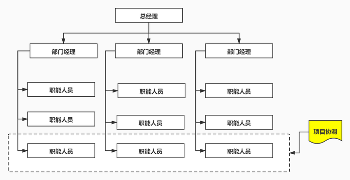
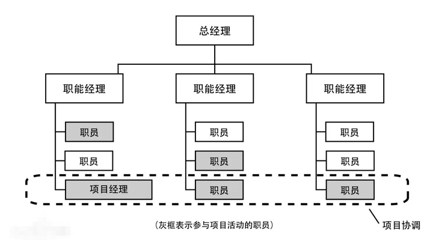
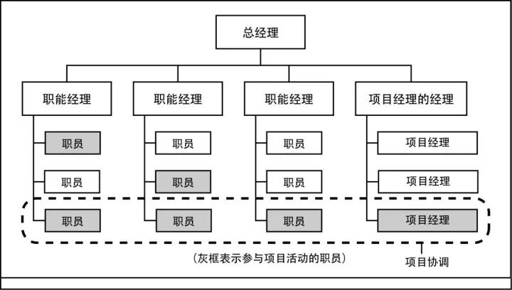
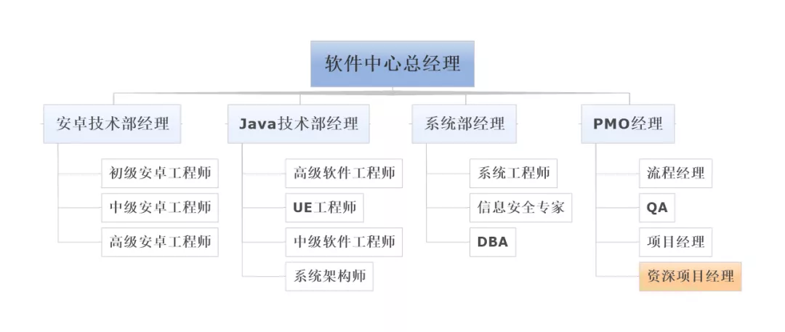
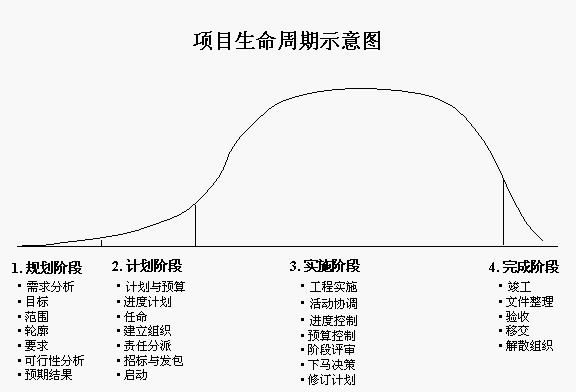

# 项目整合管理

识别、定义、组合、统合协调项目管理过程组的 各个过程 和 项目活动。

兼具统一、合并、沟通、建立联系的性质。贯穿始终。

目标：
* 资源分配
* 平衡竞争性需求
* 备选方法研究
* 裁剪过程
* 管理各个知识领域的依赖

## 整合管理基础

### 执行整合

整合管理：项目经理负责，掌握项目总体情况，承担最终责任

其他知识领域可以有其他专家干，但是整合管理只有项目经理

整合对象：
* 资源分配
* 矛盾解决
* 备选方法研究
* 过程裁剪
* 整合各个知识领域

整合层面：
* 过程层面
* 认知层面
* 背景层面

### 整合复杂性

项目整合管理复杂性的含义：多个部分、存在关联和交互作用、存在后果叠加。

### 新型实践

信息化、可视化管理工具，项目知识管理、项目外职责、混合性方法。

### 项目管理计划和项目文件

项目管理过程中 主要产生的 两类文件。

项目管理计划包含：

* 除整合管理计划外的九个子计划（进度、范围、成本、采购、沟通、干系人、风险、资源、质量 + 需求、变更、配置）
* 三个基准（范围、进度、成本）
* 绩效测量基准
* 项目生命周期描述
* 开发方法

项目文件包含（了解）：
* 活动属性
* 活动清单
* 假设日志
* 估算依据
* 变更日志
* 成本估算、持续时间估算
* 问题日志
* 等等等等

## 项目整合管理过程（包含的过程）

1. 制定项目章程 —— 项目章程是 批准项目、授权项目经理使用资源 的文件
2. 制定项目管理计划 —— 定义、和协调项目计划中的所有部分，整合成综合的项目管理计划
3. 指导管理项目工作 —— 领导执行 项目管理计划中 确定的工作，实施批准的变更
4. 管理项目知识 —— 使用、利用知识，帮助组织学习
5. 监控项目工作 —— 跟踪、审查、报告进展，确保绩效目标
6. 整体变更控制 —— 审查、批准变更，管理可交付成果、过程资产、项目文件、项目管理计划变更，沟通变更
7. 结束项目

### 裁剪考虑因素

项目是独特的。考虑裁剪项目管理过程。应该考虑：
1. 项目生命周期 —— 
2. 开发生命周期 —— 工期紧不紧等
3. 管理方法 —— 适配组织文化和项目规模
4. 知识管理 —— 比如文档共享
5. 变更
6. 治理 —— 哪些人参与项目治理？
7. 经验教训
8. 效益 —— 什么时候怎么报告效益？在项目结束还是在迭代结束？

### 敏捷和适应方法（SCRUM?）

作用：
* 帮助项目经理下放决策权，团队自行决定和控制产品的规划和交付。
* 项目经理关注营造合作型的决策氛围。

1. 范围动态：
    项目范围不会一成不变，而是在待办事项列表中动态更新维护分析排序。根据团队的吞吐能力，确定sprint中的待办事项。

## 制定项目章程

编写一份 正式批准项目、授权项目经理在项目活动中调用组织资源的计划书 的过程。

项目章程不是合同（合同是输入），用于建立内部的合作关系。

项目章程可以由发起人/项目经理编制，但是需要由金主批准启动。

其作用在于，
* 明确项目和组织战略目标的直接联系 —— 项目和组织的目标方向相匹配，才会去做
* 确立项目的正式地位 —— 是一个项目了，不能被忽视
* 组织对项目的承诺 —— 一定不鸽

输入：
1. 立项管理文件 —— 需求分析、编制项目建议书、可行性研究等
2. 协议（合同）
3. 事业环境因素 —— 政府/行业标准、法律法规、市场条件、组织文化氛围、组织框架、干系人期望etc
4. 组织过程资产 —— 组织的政策、项目治理框架、监督报告方法、模板、历史信息知识库

工具技术：
1. 专家判断 —— 判断组织战略、效益管理、项目技术知识、持续时间和预算、风险识别etc
2. 数据收集 —— 头脑风暴、焦点小组（召集干系人和主题专家讨论风险、成功标准etc，比一对一效率高）、访谈（高等级需求、假设条件、审批标准、制约因素）、delphi法则（对想法的公正评判）
3. 人际关系和团队技能 —— 冲突管理（有助于和干系人达成一致）、引导（团队员工达成一致决定）、会议管理（准备议程、请所有人、发送计划，可以联想温德姆酒店的论坛）
4. 会议 —— 目的 识别项目目标、成功标准、可交付成果、高层次需求、总体里程碑etc

输出：
1. 项目章程，包括：
  * 项目目的
  * 可测量的 目标 和 成功标准
  * 高层级的（i.e. 不具体的） 需求、项目描述、边界定义和可交付成果
  * 整体风险
  * 里程碑
  * 财务资源
  * 关键干系人
  * 项目审批要求（评价成功标准、谁下结论、谁签署项目结束）
  * 项目退出标准
  * 项目经理和职权
  * 发起人/其他批准项目的金主的姓名、职权etc

2. 假设日志

## 制定项目管理计划

对 项目计划的所有组成部分 进行 定义、准备和协调，整理成一份综合的项目管理计划

生成一份综合的文件，确定项目工作的基础和执行方式

输入：
1. 项目章程
2. 其他知识领域规划过程的输出
3. 事业环境因素
4. 组织过程资产

工具技术：
1. 专家判断 —— 判断组织战略、效益管理、项目技术知识、持续时间和预算、风险识别etc
2. 数据收集 —— 头脑风暴、焦点小组（召集干系人和主题专家讨论风险、成功标准etc，比一对一效率高）、访谈（高等级需求、假设条件、审批标准、制约因素）、delphi法则（对想法的公正评判）
3. 人际关系和团队技能 —— 冲突管理（有助于和干系人达成一致）、引导（团队员工达成一致决定）、会议管理（准备议程、请所有人、发送计划，可以联想温德姆酒店的论坛）
4. 会议 —— 目的 识别项目目标、成功标准、可交付成果、高层次需求、总体里程碑etc

# （老版）项目整合管理

项目整体管理知识领域：识别、确定、整合、统一、协调各个项目管理过程组内（十几个）不同过程和项目管理所需各过程的活动

## 制定项目章程

项目章程：**正式批准**的项目文件，**授权项目经理动用资源**。

项目经理在开始前委派，由外部签发，项目章程编写可以由外部或者项目经理完成。

项目章程包含：
1. 项目目的/批准原因
2. 可测量的目标/成功标准（比如密码机过密评）
   
   包含：成果性目标、约束性目标（比如花钱别超了也别少了）

   制定目标的注意点：
   * 成果/约束目标区分开
   * 目的/手段区分开
   * 不指定不能量化的/无法实现的目标
   * 不转移管理人员的努力方向

3. 总体要求
4. 概括性的项目描述
5. 项目的主要风险
6. 总体里程碑进度计划
7. 总体预算
8. 项目审批要求
9.  项目经理和职责
10. 发起人/其他批准人员名单和职权

输入：
1. 合同
2. 项目工作说明书 —— 业务需求、产品范围说明书、战略计划 （也算是立项管理文件）
3. 商业论证 —— 业务需求、成本效益分析、竞品分析etc
4. 事业环境因素
5. 组织过程资产

工具和技术：
1. 专家判断
2. 引导技术 —— 用于指导项目章程的制定。比如头脑风暴、冲突处理、问题解决、会议管理，是引导者用于帮助团队和个人完成项目的关键技术。

输出：
1. 项目章程

### 项目选择方法
* 净现值分析
* 投资回报率
* 投资回收期

### 项目启动会议

一个项目的开始，项目经理负责组织和召开。

目的：各干系人明确项目的目标、范围、需求、背景、职责、权限。

## 制定项目管理计划

输入：
1. 项目管理章程
2. 其他过程的输出结果
3. default*2

工具和技术：
1. 专家判断
2. 引导技术

输出：
* 项目管理计划

## 指导和管理项目执行

要求：项目经理和项目团队 采取多种行为执行项目管理计划，完成项目范围说明书中的明确工作。

还要求实施：
1. 批准的纠正措施
2. 批准的预防措施
3. 批准的缺陷补救请求（比如改bug也需要批准）

输入：
1. 项目管理计划
2. 批准的变更请求
3. default*2

工具和技术：
1. 项目管理信息系统
   * 配置管理系统：用途包括 提交变更建议，追踪审查和批准，确定变更的批准级别、确认批准的变更。大多数领域中，包含变更控制系统。类似于广义的git？
   * 变更控制系统
2. 专家判断
3. 会议

输出：
1. 可交付的成果 —— 比如密码机发版
2. 工作绩效数据 —— 比如gitee中的记录
3. 变更请求 —— 比如git commit的合并
4. 项目管理计划更新
5. 项目文件更新

## 监控项目工作

所有的监控过程组输入 都有**项目管理计划**和**绩效数据**（项目整体监控输入为**绩效信息**）
所有的监控过程组输出 都有变更请求/项目文件和管理计划更新/工作绩效信息（项目整体监控输出为**工作绩效报告**）

输入：
1. 项目管理计划
2. 进度预测
3. 成本预测
4. 确认的变更
5. 工作绩效信息
6. default*2

工具和技术：
1. 项目管理信息系统
2. 分析技术
3. 专家判断（老生常谈）
4. 会议（如上）

输出：
1. 变更请求
2. 工作绩效报告
3. 项目管理计划更新
4. 项目文件更新

## 项目整体变更控制

输入：
1. 项目管理计划
2. 工作绩效报告
3. 变更请求
4. default*2

工具和技术：
1. 变更控制工具
2. default*2

输出：
1. 批准的变更请求
2. 变更日志
3. 更新*2

图4.6：项目整体变更控制流程

## 结束项目或阶段

输入：
1. 项目管理计划
2. 验收的可交付成果
3. 组织过程资产

工具和技术：
1. 分析技术
2. default*2

输出：
1. 产品/服务/成果移交
2. 组织过程资产更新

# 项目立项管理

项目：为提供一项 **独特的产品、服务、成果**所作出的**临时性**努力。

1. 临时性：确定的开始结束日期
2. 独特性：时间、实现啥的都不同
3. 逐步完善：逐步搭建完善，分布连续积累（临时性和独特性的体现）
4. 目的性：面向目标
5. 资源约束

项目和运营的区别：

2.1.3图片

### 战略管理的过程：
* 战略制定
* 实施
* 评价

### 信息系统项目的特点
1. 目标不明确
2. 需求变化频繁
3. 智力密集型
4. 设计队伍庞大
5. 设计人员的高度专业化
6. 承包商多
7. 承包商联系复杂、地域复杂
8. 项目生命周期较短
9. 大量的新技术
10. 使用和维护的要求很复杂

### 项目经理的软技能

1. 有效的沟通
2. 影响一个组织：让事情办成的能力
3. 领导能力：形成一个前景和战略，组织人员达成之
4. 激励：激励人员达到高水平生产率，克服变革的阻力
5. 谈判和冲突管理：和其他人谈判或者达成协议
6. 问题解决：问题定义和做出决策的结合

### <a href=https://zhuanlan.zhihu.com/p/399544379>公司的组织结构（掌握）</a>

职能性组织（职能部门经理做项目协调）、矩阵型组织、项目型组织（项目经理做项目协调）

其中，矩阵型分为弱矩阵型（适用于技术简单的项目）、平衡矩阵型（）、强矩阵型

弱矩阵型（没有明确的项目经理，更像是项目协调人）：

平衡矩阵型（有明确的项目经理，但是是从组员里指定）：

强矩阵型（明确的项目经理及组织）：

### PMO（项目管理办公室，了解）

现在很多企业都在向强矩阵组织结构靠拢，这么做的目的是为了能形成一个专门的项目经理部门，这个项目经理部门就是我们通常所说的PMO。

PMO相当于把项目经理划分到自己的部门之下，同时PMO是直接向高层领导汇报工作的。这时候，PMO成为了真正意义上中立的部门。

PMO是围绕公司整体的利益，协调不同部门的职能线，形成一个联合项目组，通过协同工作去实现高层领导布置的任务目标。

说到这，你应该也发现了，PMO的职责和位置其实更适合这种跨职能部门的协调工作。

在向强矩阵组织结构转变的过程中，有些PMO是有项目经理的，有些PMO没有项目经理。

但是最终的目的都是通过项目管理办公室去进行整体的跨职能部门的工作协调，处理好所有与项目相关的工作。这也是目前咱们国家企业组织结构变革的一种趋势。

在IT行业，这种趋势其实更加明显。因为绝大部分企业的IT部门，都会产生PMO这样的角色。

尤其是在能产生产品的IT或制造业中，PMO的角色会更加明显。项目经理直接隶属于PMO，PMO会派项目经理进行跨部门的组织和协调，因为这是目前最有效的一种方式。

在这样的企业中，任何时候有IT项目，那就由PMO指派项目经理，安卓技术部、Java技术部和系统部可能会分别指派一名安卓工程师、UE工程师和系统工程师，这四个人其实就形成了一个联合项目组。

QA也就是质量保证，相当于PMO在项目管理中还有监督的职责，他会通过QA这样的角色去监督整个项目过程，看是否符合公司的规定。

### 通用项目生命周期结构

随着项目的进行，风险和不确定性逐渐降低，而变更的代价逐渐升高。

### 项目中阶段和阶段的关系

主要有两类：
1. 顺序关系：一个阶段结束后，另一个阶段才能开始。按部就班，减少不确定性，但是工期缩短难。
2. 交叠关系：阶段生命周期之间可以存在重叠。可以缩短工期，但是需要额外的资源、可能增加风险，可能返工。

### 项目开发模型

* 瀑布模型：产出 -> 评审的不断循环（看图）

* 螺旋模型：原型实现的迭代特征 和 瀑布模型中的产出-评审 相结合。每个周期分成四个阶段：制定计划、风险分析、实施工程、客户评估。强调风险分析，适用于大而复杂的、高风险的系统。

* 迭代式开发模型：从组织管理的角度描述整个软开生命周期。
  
  四个阶段：初始、细化、构造、移交。
  
  每个阶段都包括不同比例的所有活动（业务建模、需求获取、分析设计、实现、测试、部署）。

* V模型：主要描述开发和测试步骤的平行对应。
  
  具体地：
  * 编码 —— 单元测试
  * 详细设计 —— 集成测试
  * 概要设计 —— 系统测试
  * 需求分析 —— 验收测试

### 通用项目生命周期结构

对应的四个阶段是：启动项目、组织与准备、执行项目工作、结束项目。

纵轴是成本和人力投入水平。

## 一些开发模型

* 原形化模型：创建一个快速模型，可以满足干系人和用户做交互，拿着这个原型和干系人讨论分析，逐步明确需求。
  适用于难以快速定位用户需求的情况，原型的特点如下：
  1. 小而精
  2. 可运行
  3. **具有最终系统的基本特质**

* 敏捷开发模型：Scrum

### 项目管理过程组（掌握）
启动过程组、计划过程组、执行过程组、控制过程组、收尾过程组

# TODO: Scrum

# 项目立项管理

一般包括
* 提交项目建议书（立项申请），建设单位向上级主管申请时的文件。乙方想做这个东西后提交
* 项目可行性研究
* 项目投标和招标etc

# 项目范围管理

项目范围(scope)是为了达到项目目标，交付特定产品或者服务，需要做到的东西。

项目范围管理：就是确定哪些东西项目该做，哪些东西项目不该（不需要）做。

范围不明确将导致团队成员的浪费时间和目标偏离。因此，范围管理需要清晰定义项目目标。这个定义需要和干系人达成一致，然后根据范围定义划分为工作包。

## 项目范围管理概述

做且只做范围内的事。主要包括：

1. 明确项目边界 —— 哪些东西是否在项目范围内
2. 对项目执行工作进行监控 —— 该做的做了，不该做的说不
3. 防止项目范围发生蔓延 —— 蔓延：未对时间成本资源做调整，未经控制的产品/项目范围发生扩大

## 产品范围和项目范围

是项目中存在的两个相互关联的范围。

* 产品范围：产品/服务中需要包含的功能。
* 项目范围：为了交付产品，项目需要做的工作。—— 项目管理计划的基础。

基于产品范围（实际上是需求的范围）确定项目范围。因此，产品范围是项目范围的基础。

**项目的范围基准（重要）：**
* 经过批准的项目范围说明书，WBS，WBS词典

## 范围管理过程概述

| | 启动过程组 | 规划过程组 | 执行过程组 | 控制过程组 | 收尾过程组 |
|:---|:---|:---|:---|:---|:---|
| 项目范围管理 | | 
规划范围管理
收集需求
定义范围
创建WBS | | 
确认范围
控制范围 | |
| | | | | | | 

## 规划范围管理

编制范围管理计划和需求管理计划，书面描述如何定义、确认、控制项目范围的过程

输入：
1. 项目章程
2. 项目管理计划
3. default*2

工具和技术：
1. default*2

输出：
1. 范围管理计划
   
   是制定**项目管理计划**及其他过程的主要输入，包括：
   * 如何制定项目范围说明书
   * 如何根据项目管理说明书创建WBS
   * 如何维护和批准WBS
   * 如何确认和验收已完成项目的可交付成果
  
   项目范围管理计划可能是项目管理计划中的部分，也可以是单独的一份内容。可详可略，可正式/非正式。
2. 需求管理计划
   
   如何明确需求，如何达成共识、建立需求基线，如何跟踪需求、变更需求、控制需求范围保持和产品一致。

   
